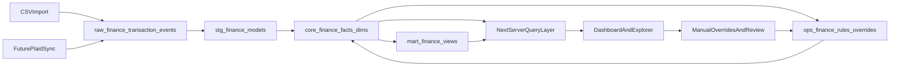

# Finance Tracker MVP

## Assumptions

- Start from an empty repo as a greenfield build.
- Optimize for a private single-user app first.
- Deliver CSV import in the first build, but shape ingestion contracts so Plaid can slot in without changing the warehouse grain.
- Keep all BigQuery access server-side.

## Target Architecture

## Phase 1: Product Shell

Create the application foundation in these files so the app has a usable shell early:

- [package.json](package.json)
- [app/layout.tsx](app/layout.tsx)
- [app/globals.css](app/globals.css)
- [app/(dashboard)/overview/page.tsx](app/(dashboard)/overview/page.tsx)
- [app/(dashboard)/transactions/page.tsx](app/(dashboard)/transactions/page.tsx)
- [app/(dashboard)/categories/page.tsx](app/(dashboard)/categories/page.tsx)
- [app/(dashboard)/merchants/page.tsx](app/(dashboard)/merchants/page.tsx)
- [app/(dashboard)/cashflow/page.tsx](app/(dashboard)/cashflow/page.tsx)
- [app/(dashboard)/rules/page.tsx](app/(dashboard)/rules/page.tsx)
- [components/dashboard/*](components/dashboard)
- [components/transactions/](components/transactions)*
- [lib/queries/](lib/queries)*
- [lib/types/finance.ts](lib/types/finance.ts)

Implementation notes:

- Use App Router, Tailwind, shadcn/ui, and Motion.
- Establish a restrained dark theme in [app/globals.css](app/globals.css): near-black surfaces, thin borders, cyan/violet accents, tabular number styles.
- Keep data fetching in server components and route handlers, not client-side BigQuery calls.

## Phase 2: Warehouse And Data Contracts

Define the warehouse before building rich UI so every later feature lands on stable grains.

Create these Dataform and query-layer files:

- [dataform/definitions/raw/transaction_events.sqlx](dataform/definitions/raw/transaction_events.sqlx)
- [dataform/definitions/raw/import_batches.sqlx](dataform/definitions/raw/import_batches.sqlx)
- [dataform/definitions/staging/transactions_clean.sqlx](dataform/definitions/staging/transactions_clean.sqlx)
- [dataform/definitions/staging/accounts_clean.sqlx](dataform/definitions/staging/accounts_clean.sqlx)
- [dataform/definitions/core/fact_transaction_current.sqlx](dataform/definitions/core/fact_transaction_current.sqlx)
- [dataform/definitions/core/fact_transaction_history.sqlx](dataform/definitions/core/fact_transaction_history.sqlx)
- [dataform/definitions/core/fact_classification.sqlx](dataform/definitions/core/fact_classification.sqlx)
- [dataform/definitions/core/dim_account.sqlx](dataform/definitions/core/dim_account.sqlx)
- [dataform/definitions/core/dim_merchant.sqlx](dataform/definitions/core/dim_merchant.sqlx)
- [dataform/definitions/core/dim_category.sqlx](dataform/definitions/core/dim_category.sqlx)
- [dataform/definitions/marts/daily_cashflow.sqlx](dataform/definitions/marts/daily_cashflow.sqlx)
- [dataform/definitions/marts/monthly_cashflow.sqlx](dataform/definitions/marts/monthly_cashflow.sqlx)
- [dataform/definitions/marts/category_spend_daily.sqlx](dataform/definitions/marts/category_spend_daily.sqlx)
- [dataform/definitions/assertions/*](dataform/definitions/assertions)
- [lib/bigquery/client.ts](lib/bigquery/client.ts)
- [lib/bigquery/params.ts](lib/bigquery/params.ts)

Warehouse rules:

- Preserve append-only inbound events in `raw`.
- Build one canonical current transaction fact for the UI.
- Partition by posted date and cluster by fields the explorer will filter constantly, such as account, transaction class, category, and merchant.
- Add assertions for duplicate transaction IDs, invalid signs, null posted dates on posted rows, orphaned categories, and impossible transfer pairs.

## Phase 3: Ingestion And Normalization

Ship CSV import first, but expose interfaces that Plaid can reuse.

Create these files:

- [app/api/import/csv/route.ts](app/api/import/csv/route.ts)
- [lib/import/csv.ts](lib/import/csv.ts)
- [lib/import/mapping.ts](lib/import/mapping.ts)
- [lib/import/normalize.ts](lib/import/normalize.ts)
- [app/api/plaid/webhook/route.ts](app/api/plaid/webhook/route.ts)
- [app/api/plaid/link-token/route.ts](app/api/plaid/link-token/route.ts)
- [lib/plaid/types.ts](lib/plaid/types.ts)

Implementation notes:

- Normalize source rows into a provider-agnostic event shape so CSV and Plaid both land in `transaction_events`.
- Capture import batch metadata and raw payload JSON for traceability.
- Treat the Plaid files as non-functional stubs initially, but define the event contract around add, modify, and remove semantics now.

## Phase 4: Categorization Engine And Review Loop

Make categorization deterministic first and keep AI as a later low-confidence fallback.

Create these files:

- [lib/categorization/normalize.ts](lib/categorization/normalize.ts)
- [lib/categorization/rules.ts](lib/categorization/rules.ts)
- [lib/categorization/transfers.ts](lib/categorization/transfers.ts)
- [app/api/categories/override/route.ts](app/api/categories/override/route.ts)
- [app/api/rules/route.ts](app/api/rules/route.ts)
- [dataform/definitions/ops/manual_overrides.sqlx](dataform/definitions/ops/manual_overrides.sqlx)
- [dataform/definitions/ops/category_rules.sqlx](dataform/definitions/ops/category_rules.sqlx)
- [dataform/definitions/ops/review_queue.sqlx](dataform/definitions/ops/review_queue.sqlx)

Behavior to implement:

- Normalize merchant and description text.
- Classify movement type before category: expense, income, transfer, credit payment, refund, fee, adjustment.
- Detect likely transfers using date windows, opposite signs, and linked-account heuristics.
- Apply rules in priority order and store the source plus confidence.
- Feed manual overrides back into future classifications.
- Leave an extension seam for AI fallback after the deterministic path is stable.

## Phase 5: Transactions Explorer

Treat this as the heart of the product.

Primary files:

- [app/(dashboard)/transactions/page.tsx](app/(dashboard)/transactions/page.tsx)
- [components/transactions/transaction-table.tsx](components/transactions/transaction-table.tsx)
- [components/transactions/transaction-filters.tsx](components/transactions/transaction-filters.tsx)
- [components/transactions/transaction-drawer.tsx](components/transactions/transaction-drawer.tsx)
- [app/api/transactions/route.ts](app/api/transactions/route.ts)
- [app/api/transactions/[id]/route.ts](app/api/transactions/[id]/route.ts)
- [app/api/search/route.ts](app/api/search/route.ts)

Explorer requirements:

- Full-text search over merchant, memo, normalized description, and notes.
- Filters for date range, account, amount range, direction, transaction class, category, merchant, and pending status.
- Right-side detail drawer with raw fields, normalized fields, rule source, confidence, and classification history.
- Manual recategorization from the drawer into the override pipeline.
- URL-driven filter state so saved views are easy later.

## Phase 6: Dashboards And Polish

Once the explorer is solid, layer on the analytical views:

- [app/(dashboard)/overview/page.tsx](app/(dashboard)/overview/page.tsx)
- [app/(dashboard)/cashflow/page.tsx](app/(dashboard)/cashflow/page.tsx)
- [app/(dashboard)/categories/page.tsx](app/(dashboard)/categories/page.tsx)
- [app/(dashboard)/merchants/page.tsx](app/(dashboard)/merchants/page.tsx)
- [components/dashboard/kpi-cards.tsx](components/dashboard/kpi-cards.tsx)
- [components/dashboard/cashflow-chart.tsx](components/dashboard/cashflow-chart.tsx)
- [components/dashboard/category-treemap.tsx](components/dashboard/category-treemap.tsx)

Polish goals:

- Keep animation subtle: card lift, number tweening, drawer transitions, chart reveal.
- Use pre-aggregated mart queries for overview screens.
- Hold search-heavy logic in explorer endpoints and dashboard-heavy logic in mart tables.
- Add saved filters and review-queue badges after the core explorer feels fast.

## Verification

- Seed the app with at least one realistic CSV import and verify raw, staging, and core rows reconcile.
- Add Dataform assertions before large UI work so warehouse regressions fail early.
- Smoke test the explorer against high-cardinality filters and large date ranges.
- Confirm manual overrides replay cleanly into current classifications.

## Recommended Delivery Order

1. App shell and theme.
2. BigQuery client and Dataform datasets.
3. CSV import into raw events.
4. Canonical current transaction fact.
5. Transactions explorer with filters and drawer.
6. Rule-based categorization and overrides.
7. Overview, cash-flow, categories, and merchants dashboards.
8. Plaid sync and AI fallback once the deterministic core is stable.

